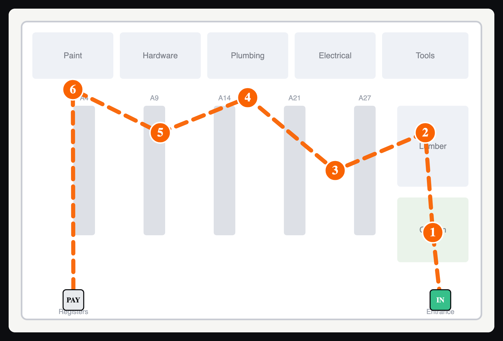

# MERTH - Most Efficient Route Through HomeDepot

> _Merth_ (Gaelic): a decision in a time of crisis.


Paste a Home Depot shared-cart URL, pick a store, and MERTH returns the shortest
walking route to collect every item - **drawn on that store's actual floor-plan
map** - then guides you through it stop by stop.



<sub>What you see: your cart's items as numbered pins and the most-efficient route
(IN to PAY) drawn on the store map. This example is produced by MERTH's real route
+ SVG-injection pipeline over a representative floor plan; a live run swaps in Home
Depot's captured store-map SVG for the store you choose.</sub>

This is **v2**: a rebuild of the original 2020 Puppeteer sprint project
(preserved in [`legacy/`](./legacy)).

## The core idea

Home Depot ships an **interactive store-map SVG** for each store, and every
product page drops a **location pin on that SVG** for the chosen store. MERTH
exploits that:

1. **Read the cart** - resolve a shared-cart URL into a list of products.
2. **Locate each item** - open each product page for the chosen store, open the
   store-map SVG, and read the drop pin's `(x, y)` straight out of the SVG.
   Because an SVG is a coordinate grid, those pins are real Cartesian points.
3. **Optimize the route** - simulated-annealing Traveling Salesman over those
   points, as an **open path** (enter at the front, finish at the registers)
   using **Manhattan distance** (you walk along aisles, not diagonally).
4. **Render** - inject the route and numbered pins back into the **real captured
   store-map SVG** and show it, alongside a walking-order pick list.

The whole point is step 4: you see the actual store map with your path on it.

## Architecture

Two parts, clean split by responsibility:

```
service/   Python (FastAPI + Scrapling) - ALL logic: scrape, TSP, SVG injection
web/       Next.js (TypeScript) - UI ONLY: form, render the returned map, pick list
legacy/    Original 2020 Puppeteer proof-of-concept (reference only)
```

- **`service/`** does the scraping (Scrapling's stealth browser), the route math
  (simulated-annealing TSP), and injects the route into the captured SVG. It
  exposes `POST /plan { cartUrl, storeId } -> { items, route, mapSvg }`.
  See [`service/README.md`](./service/README.md).
- **`web/`** is purely the interface. It calls the service through a thin
  same-origin `/api/plan` proxy and renders the returned map + pick list.

### Why Python owns the scrape (and the routing)

The routing is pure math - an LLM is strictly worse at it than the TSP solver, so
there's no agent in the hot path. And the data that matters can't come from an
API: there is **no public API** for the store floor plan or the per-product
drop-pin `(x, y)`. The only way to get them is to read the interactive store-map
SVG, exactly as the original 2020 build did. [Scrapling](https://github.com/D4Vinci/Scrapling)'s
`StealthyFetcher` is purpose-built for getting past anti-bot walls (Cloudflare,
PerimeterX, Akamai) with a de-fingerprinted browser, so it replaced the
hand-rolled Playwright scraper.

## Run it (two terminals)

Service (Python):

```bash
cd service
uv sync
scrapling install        # one-time: stealth browser + deps
cp .env.example .env      # set MERTH_PROXY if you have a residential proxy
uv run uvicorn merth_service.main:app --reload --port 8000
```

Web (Next.js):

```bash
cd web
npm install
npm run dev               # http://localhost:3000
```

Paste a shared-cart URL and a store ID, then **Plan my route**. The sample store
for testing is **#1912 - North Avenue, Chicago** (1232 W North Ave), which is
pre-filled in the store field.

## Getting past the bot wall

homedepot.com is fronted by **Akamai Bot Manager**. Scrapling clears most
fingerprint/leak detection on its own and auto-solves Cloudflare, but Akamai's
sensor scoring can still flag a **datacenter IP**. The fix is a **residential
proxy**: set `MERTH_PROXY` in `service/.env`. Verify with
`uv run python scripts/verify_scrape.py` from `service/`.

## License

MIT - Timothy Lee Long
