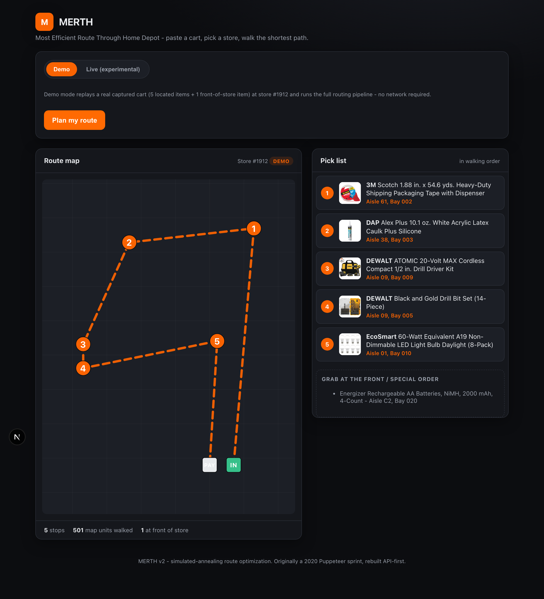

# MERTH - Most Efficient Route Through Home Depot

> _Merth_ (Gaelic): a decision in a time of crisis.


Paste a Home Depot shared-cart URL, pick a store, and MERTH returns the shortest
walking route to collect every item - rendered on a store map with an ordered,
checkable pick list.

It solves a real-world Traveling Salesman problem (simulated annealing) over the
in-store locations of your cart, then draws the route on the actual store map.

This is **v2**: a rebuild of the original 2020 Puppeteer sprint project
(preserved in [`legacy/`](./legacy)) as a Next.js + TypeScript app.



**Status:** Demo mode works end to end (try it in seconds, no setup). Live mode -
scraping a real cart from homedepot.com - is fully wired but gated by Akamai bot
protection; see [Live mode](#live-mode) for the how and why.

## What it does

1. **Read the cart** - resolve a shared-cart URL into a list of products.
2. **Locate each item** - find aisle/bay for every item at the chosen store.
3. **Optimize the route** - simulated-annealing Traveling Salesman over the item
   locations, as an **open path** (enter at the front, finish at the registers)
   using **Manhattan distance** (you walk along aisles, not diagonally).
4. **Render** - an SVG store map with the route plus a walking-order pick list.

## Architecture

```
app/
  page.tsx            Mobile-first UI (mode toggle, map, checkable pick list)
  api/plan/route.ts   POST /api/plan -> { items, route }
lib/
  salesman.ts         Open-path simulated-annealing TSP (pluggable metric, seeded)
  routing.ts          planRoute(): items -> ordered path, SVG, viewBox; aisle/bay parsing
  planner.ts          Demo + live orchestration
  fixtures.ts         Real captured cart (store #1912) for demo mode
  svg.ts              Inject route path + numbered pins into the real store-map SVG
  homedepot/
    scraper.ts        LIVE path: mobile-emulated Playwright scrape of drop-pin (x,y) + floor-plan SVG
    session.ts        (optional) Akamai session warming for the GraphQL cart path
    client.ts         (optional) federation-gateway GraphQL: cart + aisle/bay text
components/
  StoreMap.tsx        Renders the real injected store-map SVG (live) or an abstract grid (demo)
legacy/               Original 2020 Puppeteer proof-of-concept (reference only)
```

### Why this is a scrape, not "an API" (and not "an agent")

The routing is pure math - an LLM is strictly worse at it than the TSP solver, so
there's no agent in the hot path. But the data side is more subtle than "just call
the API":

- **Cart contents** and **aisle/bay text** *are* available from Home Depot's
  internal `/federation-gateway/graphql` gateway (see the optional `client.ts`).
- **Map geometry is not.** There is **no public API** for the store floor plan or
  the per-product drop-pin `(x,y)`. Those coordinates - and the map image itself -
  are the only thing that lets you draw a real route on a real map, and the only
  way to get them is to read the interactive store-map SVG, exactly as the original
  2020 build did. So live mode drives a mobile-emulated browser, reads each item's
  `g.storemarker` `data-x`/`data-y`, captures the floor-plan `<svg>`, and renders
  the route onto it.

An LLM/browser **agent** is only worth adding later as a *self-healing fallback*
for when these selectors drift.

## Run it

```bash
npm install
npm run dev          # http://localhost:3000
```

Open the app and click **Plan my route** in **Demo** mode - no network needed; it
replays a real captured cart through the full pipeline.

### Live mode

> Experimental - gated by Akamai bot protection (see findings below).

```bash
npx playwright install chromium
```

Switch to **Live**, paste a shared-cart URL and a store ID. The pipeline runs
(launches Chromium, emulates a phone, navigates the cart and each product, reads
drop pins, captures the floor plan), but **the DOM selectors are inherited from
the 2020 build and Home Depot's site has since changed** - so they will need to
be updated against the current live DOM before live mode returns real results.
Selectors live in one place: the `SELECTORS` map in
[`lib/homedepot/scraper.ts`](./lib/homedepot/scraper.ts).

**Recon findings (2026-06-25):** Live data is gated by **Akamai Bot Manager**, not
just stale selectors:
- Headless browser -> immediate **403 "Error Page"** on every URL.
- Headed browser -> homepage **200**, but product pages **still 403** after a
  homepage warm (Akamai re-validates the `_abck` sensor on deep navigation).

So the selectors cannot be re-verified until the bot wall is cleared. The
recommended way to get past it - fully automated, per store, on the fly - is a
**hosted "scraping browser"** (Bright Data / ZenRows / Oxylabs) that handles
Akamai for you. Our Playwright scraper connects to it over CDP with no logic
changes: set `SCRAPING_BROWSER_CDP_URL` (see `.env.example`) and live mode routes
through it automatically; unset, it uses a local browser (dev only). Diagnostic
scripts: [`scripts/recon.mjs`](./scripts/recon.mjs),
[`scripts/recon-headed.mjs`](./scripts/recon-headed.mjs).

There is also an unresolved question (can't be answered until past the wall):
whether the per-product store-map SVG still exists on the **web** or is now
**mobile-app-only**. The abstract-grid renderer is the fallback when no floor plan
is captured.

## Scripts

| Command | Description |
|---|---|
| `npm run dev` | Dev server |
| `npm run build` | Production build |
| `npm run typecheck` | `tsc --noEmit` |

## License

MIT - Timothy Lee Long
